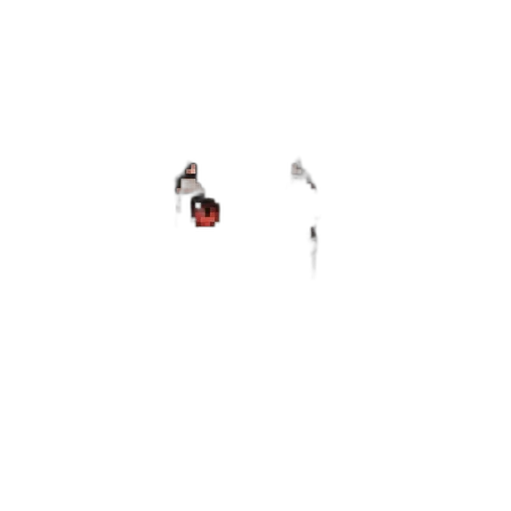
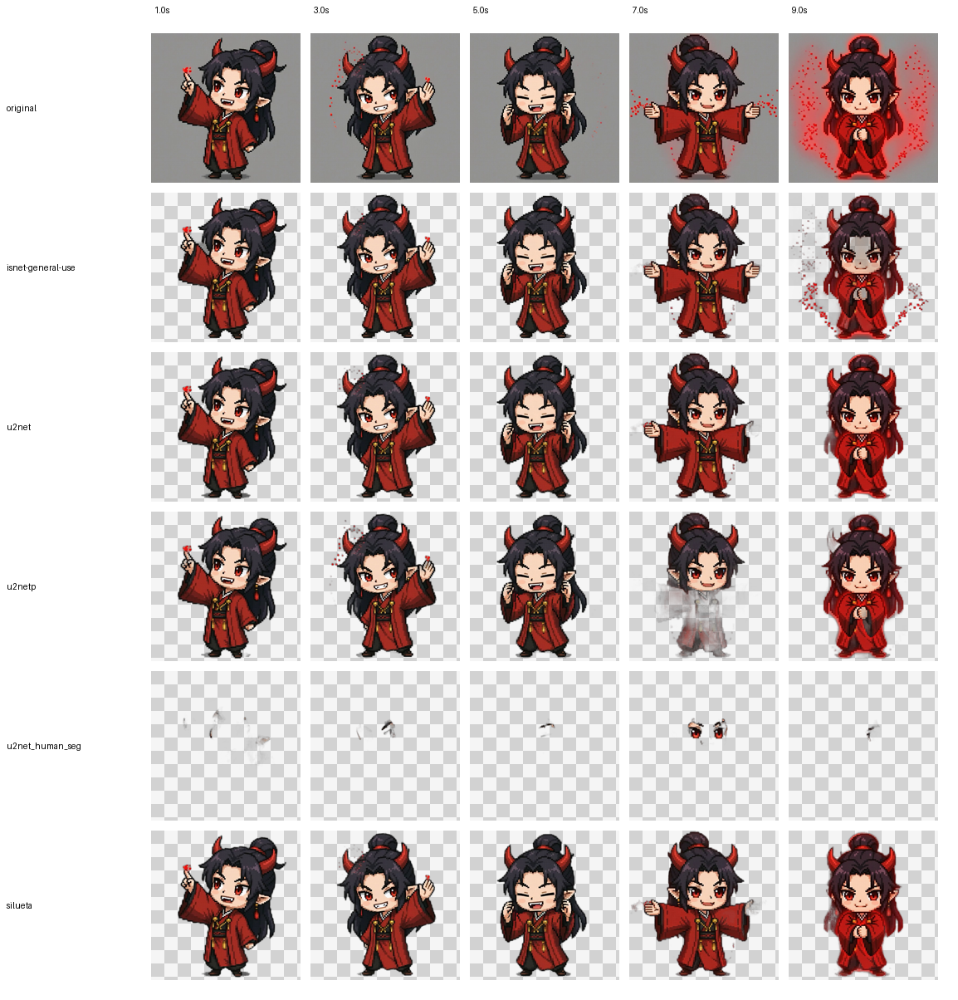
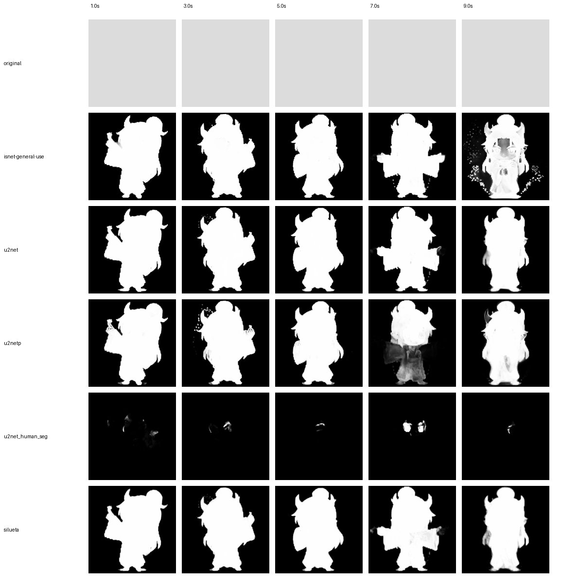

<div align="center">
  <h1>Video Background Remover CLI</h1>
  
  <p>
    
    
    
  </p>
  <p>
    <a href="README.md">
      
    </a>
    <a href="README.ja.md">
      
    </a>
  </p>
</div>

動画から被写体の背景を除去する Python CLI ツールです。`rembg` と `OpenCV` を使って、通常の動画書き出し、透過付きフレーム書き出し、アニメーション WebP / GIF 生成を行えます。

## ✨ Features

- 動画をフレーム分解して背景除去し、動画として再構成
- 一定間隔ごとに透過 `webp` / `png` フレームを書き出し
- 透過を維持したアニメーション `webp` / `gif` を生成
- 単色背景または背景画像への差し替えに対応
- `isnet-general-use` / `u2net` / `u2netp` / `u2net_human_seg` / `silueta` を切り替え可能

## 📋 Requirements

- Python 3.10 以上
- FFmpeg 不要
- 初回実行時はモデルのダウンロードが発生します

## 🛠️ Setup

### `pip` を使う場合

```bash
pip install -r requirements.txt
```

### `uv` を使う場合

```bash
uv sync
```

## 🚀 Quick Start

### 1. 背景を白で埋めた動画を出力

```bash
python main.py assets/onizuka_idle_motion.mp4 output/output_white.mp4 --bg-color white
```

### 2. 透過付きアニメーション WebP を出力

```bash
python main.py assets/onizuka_idle_motion.mp4 output/output_animated.webp --animated webp --webp-fps 10
```

### 3. 1 秒ごとに透過フレームを書き出し

```bash
python main.py assets/onizuka_idle_motion.mp4 output/frames --interval 1 --format webp
```

## 💡 Usage

```bash
python main.py INPUT OUTPUT [options]
```

### 通常の動画出力

```bash
python main.py input.mp4 output.mp4 --bg-color white
python main.py input.mp4 output.mp4 --bg-image background.jpg
python main.py input.mp4 output.mp4 --fps 30
```

通常の動画出力ではアルファ付き動画は生成しません。背景を明示したい場合は `--bg-color` または `--bg-image` を指定してください。

### 透過フレームの書き出し

```bash
python main.py input.mp4 output/frames --interval 0.5 --format webp
python main.py input.mp4 output/frames --interval 1 --format png
```

`--interval` を指定すると、`OUTPUT` はファイルではなく出力先ディレクトリ名として扱われます。

### アニメーション WebP / GIF 出力

```bash
python main.py input.mp4 output/output_animated.webp --animated webp
python main.py input.mp4 output/output.gif --animated gif --webp-fps 8
python main.py input.mp4 output/output --animated both --webp-fps 8 --max-frames 120
```

`--animated both` を指定すると、同じベース名で `.webp` と `.gif` の両方を出力します。

## ⚙️ Options

| Option | Description |
| --- | --- |
| `--model` | 背景除去モデル。デフォルトは `isnet-general-use` |
| `--fps` | 通常の動画出力時の FPS。未指定なら入力動画を使用 |
| `--bg-color` | 背景色。`white` / `black` / `green` / `blue` / `red` / `gray` / `transparent` または `255,128,0` 形式 |
| `--bg-image` | 背景に合成する画像パス |
| `--keep-frames` | 中間フレームを削除せず保持 |
| `--work-dir` | 作業用フレームの保存先 |
| `--interval` | 指定秒数ごとにフレームを抽出 |
| `--format` | `--interval` モードの出力形式。`webp` または `png` |
| `--animated` | アニメーション出力。`webp` / `gif` / `both` |
| `--webp-fps` | アニメーション出力時の FPS |
| `--max-frames` | アニメーション出力時の最大フレーム数 |

## 🧠 Models

| Model | Description |
| --- | --- |
| `isnet-general-use` | 汎用。デフォルト設定 |
| `u2net` | サリエントオブジェクト向け |
| `u2netp` | `u2net` の軽量版 |
| `u2net_human_seg` | 人物セグメンテーション向け |
| `silueta` | 高品質寄りだが遅め |

## 炎エフェクト比較

検証素材: `assets/onizuka_fire_motion.mp4`

使用した設定:

```bash
python main.py assets/onizuka_fire_motion.mp4 output/model.webp --animated webp --webp-fps 8 --model <model>
```

| Model | WebP | メモ |
| --- | --- | --- |
| `isnet-general-use` |  | 炎の成分を少し残すが、周囲にノイズも出やすい |
| `u2net` |  | 人物の形は安定するが、炎のオーラはかなり消える |
| `u2netp` |  | 最速だが、複雑なフレームで崩れやすい |
| `u2net_human_seg` |  | この素材では人物抽出が崩れて不向き |
| `silueta` |  | この比較では一番バランスが良い |

### 実験のまとめ

- この素材では `silueta` が最もバランスの良い結果でした。
- 輪郭を安定させたいなら `u2net` が次点候補です。
- `u2net_human_seg` はエフェクトの強いこのサンプルには向いていません。

### 比較画像





## 🖼️ Output Examples

- 入力動画: `assets/onizuka_idle_motion.mp4`
- アニメーション WebP: `example/output_animated.webp`
- GIF: `output/output.gif`
- 比較用 GIF: `example/onizuka_walk_motion.gif`
- 比較用 WebP: `example/onizuka_walk_motion.webp`
- 透過フレーム: `output_frames_webp/`

### GIF / WebP 比較

| GIF | WebP |
| --- | --- |
|  |  |

## 📝 Notes

- モデルの初回ロードには時間がかかります
- 長い動画を `--animated gif` で出力するとファイルサイズが大きくなります
- 動画として書き出す場合、透過を保持したい用途には `--animated webp` または `--interval` の利用が適しています
